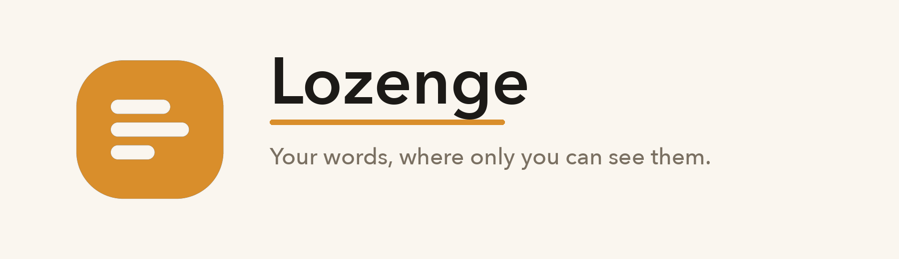
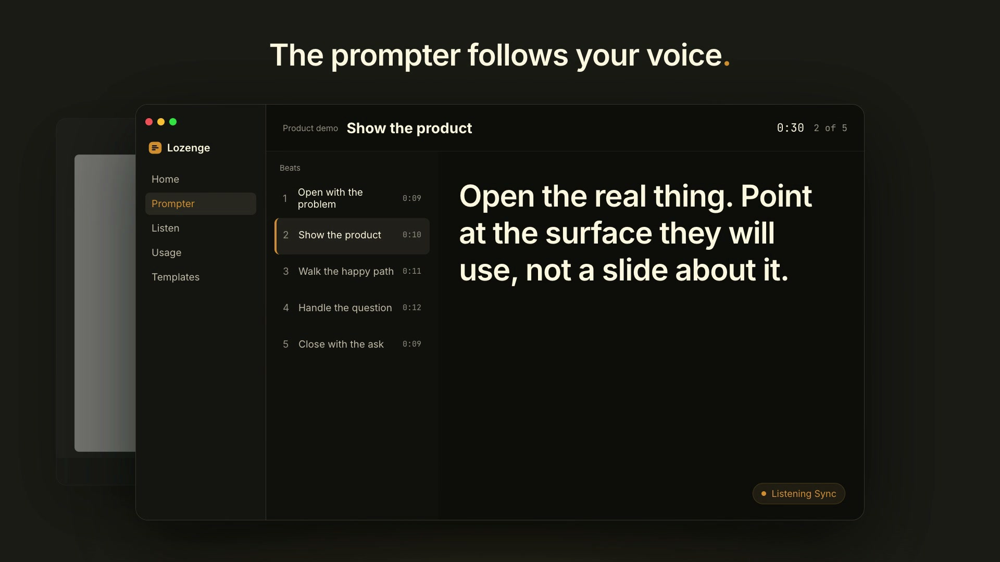
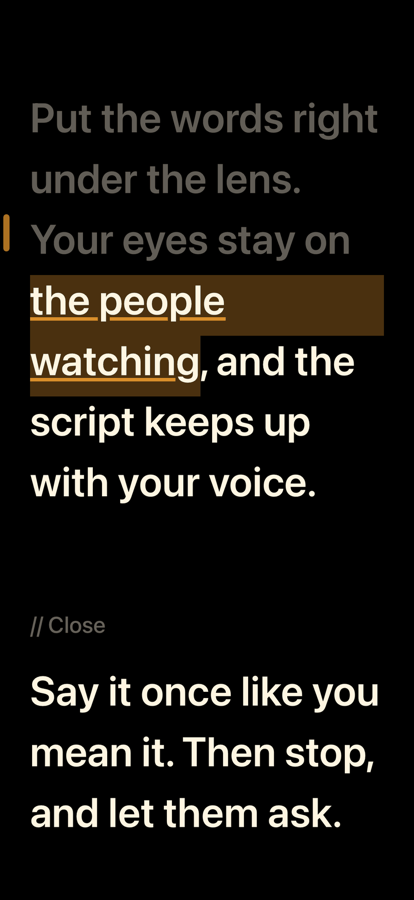

<div align="center">

<a href="https://lozenge.ai">
  <picture>
    <source media="(prefers-color-scheme: dark)" srcset=".github/readme/lockup-dark.png">
    
  </picture>
</a>

### The Mac teleprompter that follows your voice and stays out of your screen share.

<br>

[](https://github.com/mrlynn/lozenge-releases/releases/latest)
[](https://github.com/mrlynn/lozenge-releases/releases/latest)
[](https://github.com/mrlynn/lozenge-releases/releases)
[](#install)
[](#install)

[](#check-the-download)
[](#check-the-download)
[](#private-by-design)
[](#check-the-download)
[](#updates-and-betas)

[](#what-it-does)
[](#what-it-does)
[](#private-by-design)
[](#private-by-design)
[](https://lozenge.ai/pricing)

<br>

<a href="https://github.com/mrlynn/lozenge-releases/releases/latest"></a>
&nbsp;
<a href="https://lozenge.ai"></a>

<br><br>

<a href="https://lozenge.ai">
  
</a>

</div>

<br>

## Both sides of the conversation. Ready before you speak.

Lozenge prepares your lines and their questions together. Then the prompter
listens and follows your voice through the script, so you keep pace without
watching a clock. All of it in a window the room cannot see.

A notetaker starts when you stop talking. Lozenge covers the hour on either
side of that, and the part in the middle where you are the one speaking.

<br>

## Present in the room. Invisible to it.

Zoom, Meet, and a Slack huddle all capture the desktop the same way, and
Lozenge sits outside that capture by default.

| | |
| :-- | :-- |
| **The window opts out** | The prompter, the Confidence Monitor, the notch prompter, the phone remote, and the delivery report ask macOS to leave them out of a full desktop or full screen capture. |
| **Everything else is still shared** | Your editor, your browser, your deck. The share looks exactly as it should. Lozenge is not in it. |
| **You can lift it on purpose** | Turn capture back on to record the app itself. While it is on, an eye badge sits in the sidebar and the prompter header, so you never forget it is on. |

> [!TIP]
> Check it yourself in ninety seconds. Share your whole screen in a meeting,
> join the same call from your phone, and look for the window.

<br>

## What it does

<table>
<tr>
<td width="50%" valign="top">

### 🍯&nbsp; Prompter

For the part where you are talking.

- **Follows your voice.** Listening Sync matches what you say against the
  script and moves the beat when you reach it. A paraphrase does not throw it
  and a pause does not race ahead.
- **Reads under the camera.** The notch prompter hangs the current beat a
  finger's width from the lens.
- **A second screen only you read.** The Confidence Monitor shows the beat,
  the time left, what comes next, and a slide preview.
- **Fades to almost nothing.** Ghost dims the chrome and keeps the words.
- **Moves your slides.** Say "next slide" and a paired Google Slides deck
  moves with you.
- **Imports what you have.** Word, PDF, Markdown, PowerPoint, or Google
  Slides, with a cost estimate before a model writes a word.
- **Rehearse with a coach.** A delivery report after each take shows pace,
  skipped beats, fillers, and your longest pauses.

</td>
<td width="50%" valign="top">

### 🌿&nbsp; Listen

For the part where they are talking.

- **No bot in the room.** Nothing dials in and nothing announces itself.
  Lozenge hears your microphone and, when you turn it on, your Mac's audio.
- **Transcribes on your Mac.** Apple's on-device speech engine, or Whisper
  running locally, with speaker labels from a local model.
- **Templates that know the room.** Seventeen ship with it, from a
  recruiting interview to an incident postmortem.
- **Answers from your own docs.** Point it at a folder of Markdown, text,
  and PDF files. A live answer names the files it used.
- **Star the moment.** Bookmark a timestamp with a note while you listen.
- **Leave with a file.** A wrap-up brief, a follow-up email draft in your own
  mail app, and a transcript saved as Markdown.
- **Ask your sessions.** Ask a question across saved conversations. Every
  claim names its session and the moment in it.

</td>
</tr>
</table>

<br>

## Who it is for

Anyone who has to be good at a conversation on a schedule.

| | |
| :-- | :-- |
| **Sales and solutions engineers** | A live product demo where the click path and the sentence have to land together. |
| **Recruiters and hiring managers** | A screening call where the questions came from the job description and the resume you attached this morning. |
| **Managers running 1:1s and reviews** | A conversation you wrote down beforehand because you meant to say it exactly once, and well. |
| **Anyone briefing a room** | An enablement session, a QBR, a postmortem, a discovery call. Write the track once and read it clean every time. |

<br>

## Private by design

Lozenge is a tool for the person doing the talking. It is not a supervisor, a
scorecard, or a way to watch somebody else work.

- 🔒 **No account needed.** You do not sign up to use Lozenge.
- 💾 **Your files stay your files.** Sessions, transcripts, templates, and
  delivery reports are written to disk where you put them. None of them are
  uploaded, and none of them sync.
- 🎙️ **Transcription runs on device by default.** Audio does not leave your
  Mac on the default setting. A cloud engine is an explicit switch, with your
  own key.
- 🔑 **You bring your own model key.** Research and live answers call the
  provider you chose, or Ollama on your own Mac. Keys live in the macOS
  Keychain and are never logged.
- ⏸️ **Nothing runs until you start it.** The microphone opens when you start
  a session, and Stop closes it.
- 📦 **Sandboxed.** The app runs inside the macOS App Sandbox.

The full account is in the [privacy policy](https://lozenge.ai/privacy).

<br>

## Install

<table>
<tr><td><b>Requires</b></td><td>macOS 14 Sonoma or later</td></tr>
<tr><td><b>Runs on</b></td><td>Apple silicon and Intel</td></tr>
<tr><td><b>Download</b></td><td><code>lozenge-&lt;version&gt;.dmg</code> from the <a href="https://github.com/mrlynn/lozenge-releases/releases/latest">latest release</a></td></tr>
<tr><td><b>Distribution</b></td><td>Direct download. Not the Mac App Store.</td></tr>
</table>

1. Download the DMG from the [latest release](https://github.com/mrlynn/lozenge-releases/releases/latest).
2. Open it and drag **Lozenge** to **Applications**.
3. Launch it. Home opens with a **Teleprompter** card and a **Meeting
   assistant** card.
4. Press **Try the Welcome Script**, then **Start Scrolling**.

macOS asks for the microphone the first time you use Listen or Follow Voice,
and for anything else only when a feature needs it.

<br>

## Check the download

Every release lists the SHA-256 of its DMG in the release notes and attaches
it as `lozenge-<version>.dmg.sha256`. In Terminal, in the folder you
downloaded to:

```bash
shasum -a 256 lozenge-<version>.dmg
```

The line it prints must match the one in the release.

The app is signed with a Developer ID for **Michael Lynn** (team
`YZ36Z8GSEN`) and notarized by Apple. To see that for yourself after
installing:

```bash
spctl --assess --type execute -v /Applications/Lozenge.app
```

It says `accepted` and `source=Notarized Developer ID`.

<br>

## Updates and betas

Lozenge updates itself through [Sparkle 2](https://sparkle-project.org).
Every update is the same signed, notarized DMG published here, and Sparkle
checks its signature before it installs anything.

| Channel | What you get | How to get it |
| :-- | :-- | :-- |
| **Release** | The build marked **Latest** above | The default |
| **Beta** | Pre-releases of the next version, marked with a violet beaker | **Settings > Labs > Get beta updates** |

Turning betas off keeps the build you have until the next release replaces it.
What changed in each version is in its [release notes](https://github.com/mrlynn/lozenge-releases/releases).

<br>

## Lozenge Companion for iPhone

<table>
<tr>
<td width="62%" valign="middle">

A teleprompter of its own. It follows your voice on the phone, records a take
from the front camera while you read, and needs no Mac.

Paired with your Mac, it is an encrypted remote for the prompter, and it can
follow a Listen session as it happens.

[About the companion](https://lozenge.ai/companion)

</td>
<td width="38%" align="center">

</td>
</tr>
</table>

<br>

## About this repository

This repository holds signed releases only. There is no source code here. The
product page is [lozenge.ai](https://lozenge.ai).

- [Terms](https://lozenge.ai/terms)
- [Privacy policy](https://lozenge.ai/privacy)
- [Support](https://lozenge.ai/support)
- Questions: [hello@lozenge.ai](mailto:hello@lozenge.ai)

<br>

<div align="center">
  <a href="https://lozenge.ai">
    <picture>
      <source media="(prefers-color-scheme: dark)" srcset=".github/readme/lockup-dark.png">
      
    </picture>
  </a>
  <br>
  <sub>Made for the person doing the talking.</sub>
</div>
